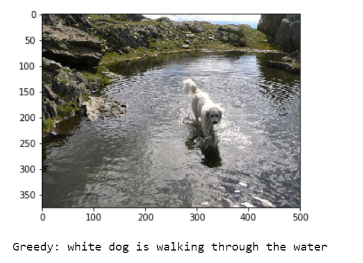

# Image-Caption-Generation
We can generate captions by analyzing the image features.

# Initialization
If we want to implement this project then we have to download the proper datasets and 
dictionary which having lots words in it.

Download Glove.6B.zip - https://nlp.stanford.edu/projects/glove/

Download Flickr8k Dataset - https://academictorrents.com/details/9dea07ba660a722ae1008c4c8afdd303b6f6e53b

# Results after training 
As you can see it's pretty good caption for this image.

